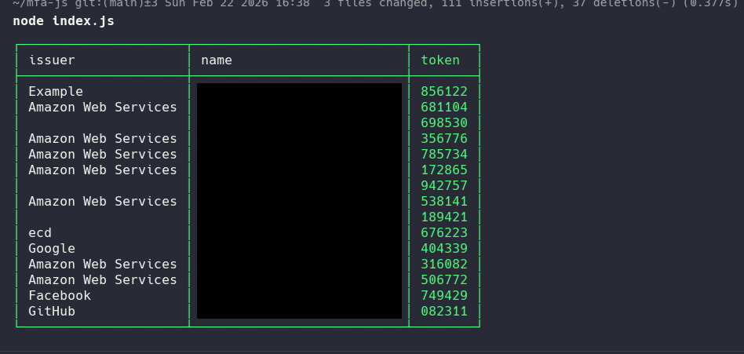
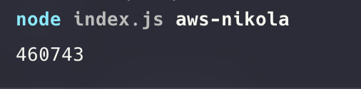
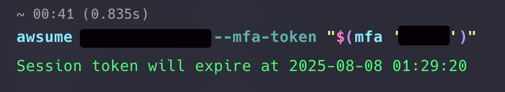

# About project
mfa-js is a free, open-source and lightweight MFA CLI application! It allows migration from google authenticator or other mfa clients.

## Prerequirements
* Node or Bun
* npm or yarn or Bun (As package manager)

## Setup
Clone the repo

```
git clone https://github.com/nikola-matkovic/mfa-js.git
```

Install packages
```
cd mfa-js
npm install
```
# First time usage and migration
You can
* Migrate MFA codes from google authenticator
* Add Regular MFA qr codes.
* Import manually or migrate from another device

You can skip migrating from google section but I strongly recommend it to make a switch easier.

## Migrating from google
There is small "tutorial" how to migrate from google:
On your phone, go to Google Authenticator → click menu icon ☰ → "Transfer accounts" (name may vary depending on device language).
Now export codes, select all MFA accounts you want to export, click Next.
It will show you a QR code — screenshot it and click Next.

If there are many MFA codes, there could be multiple QR codes.
When asked for removing accounts, click Keep existing codes.

Place QR screenshots inside the ```qrcodes``` folder.

## Adding regular MFA codes
Just screenshot MFA QR codes and add it to ```qrcodes``` folder

## Manual import
You can run ```node index.js --import``` and follow instructions. Use this option to import when you only have mfa secret key, when you have url in format ```otpauth://``` or if you migrating codes from one device to another with this script.

# Basic usage
Show all codes:
```
node index.js
```


Search specific one
```
node index.js name
```


You don’t need to type the full name — for example, in my case:  ``` node index.js nik``` would work just fine.
If there are multiple matches, it will return the first one. If you want to return all found results in search add ```--multiple``` flag

## Adding new mfa codes
Just place new screenshots and run script with ```--read-qr-codes``` flag. Do not worry - You will be asked if there is deletion, or rename of existing ones

You can also run script with ```--import``` flag and follow instructions.

# All flags - advanced
You can see all available options with ```--help``` flag. This is current output of ```--help```
```
First time usage:
    Screenshot MFA QR codes (from google auth export or regular mfa qr codes) and place screenshots in "qrcodes" folder
    Then run  node index.js

Show all:
   node index.js

Search specific one:
   node index.js <name>

Add new tokens:
  You can simply place new screenshots to qrcodes folder and run script with -q flag, or --import
   node index.js -q
   node index.js --import

Arguments:
  name      Search MFA entry by name or issuer. If omitted, all entries are shown.
            By default only show first match. You can add    --multiple   to show all found matches

Options:

  -c, --copy, --auto-copy
      Copy MFA token - if found.

  -m, --multiple
      Shows all matches - not just first one. Used with name argument!

  -q, --read-qr-codes
      Scan qr codes from qrcodes folder
      Adds new codes and asks before rename/delete.

  -o, --overwrite
      Used with -q
      Force recreating all MFAs without checking for deletion, rename or addition
      (Treats qrcodes folder as single source of truth, possible data lose)

  -r, --rename
      Rename existing MFA entry.

  -d, --delete
      Delete existing MFA entry/entries.

  -e, --export
      Export MFA codes (Supports showing qr code in terminal, otpauth:// URL or json)

  -i, --import
      Import new MFA.
      Supports: otpauth:// URL, Google migration URL or Manual secret entry

  --restore
      If you made some mistake and lost, you can restore old version.
      By default full history is saved to prevent data loss.

   --qrcodes-path
      Use different qrcodes location.
      Strongly recommended to use this alongside --mfa-path to prevent data loss.

   ----mfa-path
      Use different mfa directory location.
      Strongly recommended to use this alongside --qrcodes-path to prevent data loss.

  -h, --help
      Show this help message.

  -a, --all
      Show all saved MFA codes. It's default when name is not specified

```

# My working scenario / example
I wrote this script to solve a real problem — I work on a large number of AWS accounts, all with MFA enabled. Constantly checking my phone was annoying and time-consuming.

You can create an alias for running this script like so:

```alias mfa="node ~/work/scripts/mfa-js/index.js" ```

Now I can simply run: ```mfa nikola``` when I want my AWS account MFA code. For console usage, I also integrated it with awsume: ```awsume```

```
awsume aws_profile_name --mfa-token "$(mfa 'mfa-name')"
```



You can further automate it to suit your needs and add aliases, but that is not within the scope of this script.

Happy hacking 💙
